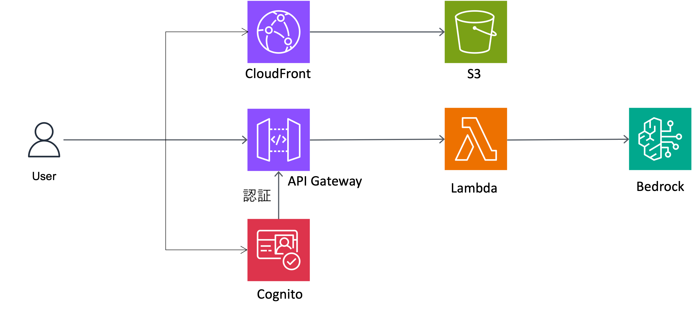

# Bedrock Chatbot with Cognito Authentication

Amazon Bedrock を使用したチャットボットアプリケーションで、Amazon Cognito による認証機能を備えています

## 機能

- Amazon Bedrock の LLM モデル（Nova Lite または Nova micro）を使用したチャット機能
- Amazon Cognito によるユーザー認証
- API Gateway による安全な API アクセス
- CloudFront + S3 によるフロントエンドホスティング
- AWS CDK を使用したインフラのコード化

## アーキテクチャ



## 前提条件

- [Node.js](https://nodejs.org/) (v14 以上)
- [AWS CLI](https://aws.amazon.com/cli/) (設定済み)
- [AWS CDK](https://aws.amazon.com/cdk/) (v2)
- [Python](https://www.python.org/) (v3.9 以上)

## セットアップ手順

### 0: Bedrockモデルアクセス許可の設定

このアプリケーションを使用するには、AWS Bedrockのモデルへのアクセス許可が必要です<br>
以下の手順でモデルアクセスを有効にしてください

1. AWS Managementコンソールにログイン
2. 利用するリージョンを「us-east-1」に移動
3. BedRockサービスに移動
4. メニューのナビゲーションから「モデルアクセス」を選択
5. 「特定のモデルを有効にする」を選択
6. 「Amazon Nova Lite」, 「Amazon Nova Micro」の横にあるチェックボックスをオンにする
7. 画面下部の「次へ」ボタンをクリックし、内容を確認の上、「送信」をクリックする

* Cross Region Inferenceが有効となっているリージョンを推奨します。
* アクセス許可がない状態で環境をセットアップした場合、チャットボットは500エラーを返します


### 1. CloudShell環境設定
演習では利用環境を統一するためにCloudShellを利用します。(適切な設定を行えば、ターミナルからの利用も可能です。) <br>
CloudShellを利用する場合、割り当てられるストレージ容量の関係で、以下の手順に従い /tmp配下で実施してください。

```bash
mkdir /tmp/testdir 
cd /tmp/testdir/
export npm_config_cache=/tmp/npm-cache
export npm_config_prefix=/tmp/npm-global
sudo npm install -g aws-cdk@latest

```

### 2. リポジトリのクローン

```bash
cd /tmp/testdir/
git clone https://github.com/keisskaws/simplechat.git
cd simplechat

```

### 3. CDK プロジェクトの依存関係 && フロントエンドのビルド

```bash
npm install

```

### 4. AWS アカウントのブートストラップ（初回のみ）

```bash
cdk bootstrap

```

### 5. CDK スタックのデプロイ

```bash
cdk deploy

```

### 6. アプリケーションへのアクセス

デプロイ出力に表示された [CloudFront URL] にアクセスしてアプリケーションを使用します

使用方法
- CloudFront URL にアクセスします
- 「Create Account」をクリックして新しいアカウント(メールアドレス、パスワード)を作成します
- 登録したメールアドレスに送信された確認コードを入力します
- ログイン後、チャットインターフェースが表示されます
- メッセージを入力して Amazon Bedrock モデルと対話します


## カスタマイズ
### Bedrockモデルの変更

bin/bedrock-chatbot.ts ファイルを編集します
```bash
vi bin/bedrock-chatbot.ts

```

modelIdを変更してモデルを変更します
```typescript 

new BedrockChatbotStack(app, 'BedrockChatbotStack', {
  //modelId: 'us.amazon.nova-lite-v1:0',
  modelId: 'us.amazon.nova-micro-v1:0',
  // ...
});
```

変更したスタックを再デプロイします
```bash
cdk deploy

```

### カスタマイズ:　外部モデルの利用

lambda/index.py のbedrock_client.invoke_modelからBedrock APIを呼び出しています<br>
関数を変更し、呼び出すモデルに合わせて変更することで、別のモデルを使ったチャットボットに改良できます

```bash
vi lambda/index.py

```

変更したスタックを再デプロイします
```bash
cdk deploy

```


### カスタマイズ: フロントエンド

フロントエンドのコードは frontend/src ディレクトリにあります。React コンポーネントを編集してカスタマイズできます

```bash
cd frontend
src/ 配下のファイルを編集

```

frontend/ でビルドを実行する
```bash
npm run build
cd ..

```

変更したスタックを再デプロイします
```bash
cdk deploy

```

### クリーンアップ
プロジェクトのリソースを削除するには以下のコマンドを実行します

```bash
cdk destroy

```


## トラブルシューティング

### API 呼び出しエラー

- API Gateway->API->Bedrock Chatbot API に移動
- リソースのPostを選択し、メニューから[テスト]を選択

クエリ文字列
- 入力なし


ヘッダー
```
Content-Type: application/json
```

リクエスト本文
```JSON
{ 
        "message": "Tell me about AI and Machine learning",
        "conversationHistory": [] 
}
```

- テストメッセージを入力し、問題がないかを確認

### Lambda エラー

- Lambd->関数->BedrockChatbotStack-ChatFunction.... に移動
- リソースのPostを選択し、メニューから[テスト]を選択

イベント名(任意)
```
MyTest
```

イベントJSON
```JSON
{
  "body": "{\"message\":\"What is Momotaro story?\",\"conversationHistory\":[]}",
  "resource": "/chat",
  "path": "/chat",
  "httpMethod": "POST",
  "headers": {
    "Content-Type": "application/json"
  }
}
```

- イベント名、イベントJSON(テストメッセージ)を入力し、問題がないかを確認


### 認証エラー
- Cognito画面でユーザープールの設定を確認してください
